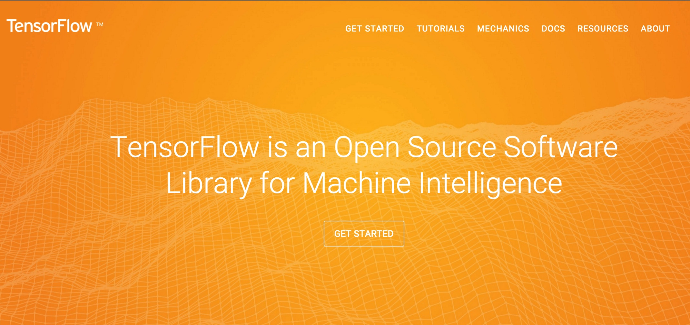

# TensorFlow 官方文档中文版

### 你正在翻译的项目可能会比 Android 系统更加深远地影响着世界！

## 缘起 

2015年11月9日，Google 官方在其博客上称，Google Research 宣布推出第二代机器学习系统 TensorFlow，针对先前的 DistBelief 的短板有了各方面的加强，更重要的是，它是开源的，任何人都可以用。

机器学习作为人工智能的一种类型，可以让软件根据大量的数据来对未来的情况进行阐述或预判。如今，领先的科技巨头无不在机器学习下予以极大投入。Facebook、苹果、微软，甚至国内的百度。Google 自然也在其中。「TensorFlow」是 Google 多年以来内部的机器学习系统。如今，Google 正在将此系统成为开源系统，并将此系统的参数公布给业界工程师、学者和拥有大量编程能力的技术人员，这意味着什么呢？

打个不太恰当的比喻，如今 Google 对待 TensorFlow 系统，有点类似于该公司对待旗下移动操作系统 Android。如果更多的数据科学家开始使用 Google 的系统来从事机器学习方面的研究，那麽这将有利于 Google 对日益发展的机器学习行业拥有更多的主导权。

为了让国内的技术人员在最短的时间内迅速掌握这一世界领先的 AI 系统，极客学院 Wiki 团队发起对 TensorFlow 官方文档的中文协同翻译。

欢迎各路人工智能及机器学习领域的专家和爱好者参与这一翻译项目，我们会为每位翻译和校对人员署名。

## 一起来参与

如果想做出贡献(翻译或者校对)的话，请加QQ群：248320884，谢谢！

PS: 想探讨TensorFlow技术的可以加"TensorFlow技术交流群"：495115006

## 内容来源

英文官方网站：     
<http://tensorflow.org/>

官方GitHub仓库：   
<https://github.com/tensorflow/tensorflow>

中文版 GitHub 仓库：  
<https://github.com/jikexueyuanwiki/tensorflow-zh>

## 参与步骤

* fork主仓库（<https://github.com/jikexueyuanwiki/tensorflow-zh>）
* 按照章节认领翻译(每次申请一个章节)，在下面这个`README.md`里找还没有被人申请的章节，写上（@你的github号），给主仓库的`master`分支提pull request；
* 提的 pull request 被确认，合并到主仓库后，代表你申请的章节*认领*完成，开始翻译；
* 翻译过程请参 *翻译协作规范* ，完成翻译后提交 pull request 给主仓库的`master`分支；
* 校核完成后，从主仓库的`master`分支合并到主`publish`分支；
* 全部翻译完成后，生成PDF/ePub文档，放在极客学院Wiki平台发布；

## 翻译协作规范   

为了让大家协作顺畅，需要每一个人遵循如下协作规范~

- 如果对Markdown和GitHub不了解，请先阅读[如何使用Markdown](markdown.md)以及[如何使用GitHub](learn-github.md)
- 使用Markdown进行翻译，文件名必须使用英文
- 翻译后的文档请放到SOURCE文件夹下的对应章节中，然后pull request即可
- 如遇到文中的图片，请统一放在SOURCE/images目录下
- 原文中的HTML标签及代码请不要修改、翻译
- 有其他任何问题都欢迎发issue，我们看到了会尽快回复
- 翻译人员需将对应的原文地址和翻译人姓名添加到译文末尾，审校人员需要将自己的名字添加到译文末尾，具体格式请参见样例：   

> 原文：[Color Palettes](http://www.google.com/design/spec/resources/color-palettes.html)  翻译：[iceskysl](https://github.com/iceskysl)  校对：[PoppinLp](https://github.com/poppinlp)   

## 参与者（按认领章节排序）

### 翻译

- 起步
  - [介绍](SOURCE/get_started/introduction.md) （[此处添加翻译者姓名及链接](https://github.com/xxx)）（[@PFZheng](https://github.com/PFZheng)）
  - [下载及安装](SOURCE/get_started/os_setup.md) （[@PFZheng](https://github.com/PFZheng)）
  - [基本用法](SOURCE/get_started/basic_usage.md) （[@PFZheng](https://github.com/PFZheng)）
- 教程
  - [Overview](SOURCE/tutorials/overview.md) （[@PFZheng](https://github.com/PFZheng)）
  - [MNIST For ML Beginners](SOURCE/tutorials/mnist_beginners.md) ([@Tony Jin](https://github.com/linbojin))
  - [Deep MNIST for Expert](SOURCE/tutorials/mnist_pros.md)([@chenweican](https://github.com/chenweican))
  - [TensorFlow Mechanics 101](SOURCE/tutorials/mnist_tf.md)
  - [Convolutional Neural Networks](SOURCE/tutorials/deep_cnn.md)([@oskycar](https://github.com/oskycar))
  - [Vector Representations of Words](SOURCE/tutorials/word2vec.md)（[@xyang40](https://github.com/xyang40)）
  - [Recurrent Neural Networks](SOURCE/tutorials/recurrent.md)([@Warln](https://github.com/Warln))
  - [Mandelbrot Set](SOURCE/tutorials/mandelbrot.md)
  - [Partial Differential Equations](SOURCE/tutorials/pdes.md) 
  - [MNIST Data Download](SOURCE/tutorials/mnist_download.md)
- 运作方式
  - [总览](SOURCE/how_tos/overview.md) 
  - [变量:创建、初始化、保存和加载](SOURCE/how_tos/variables.md) ([@zhyhooo](https://github.com/zhyhooo))
  - [TensorBoard:可视化学习](SOURCE/how_tos/summaries_and_tensorboard.md) ([@thylaco1eo](https://github.com/thylaco1eo))
  - [TensorBoard:图表可视化](SOURCE/how_tos/graph_viz.md) 
  - [读取数据](SOURCE/how_tos/reading_data.md) 
  - [线程和队列](SOURCE/how_tos/threading_and_queues.md) 
  - [添加新的Op](SOURCE/how_tos/adding_an_op.md) 
  - [自定义数据读取](SOURCE/how_tos/new_data_formats.md) 
  - [使用gpu](SOURCE/how_tos/using_gpu.md) 
  - [共享变量](SOURCE/how_tos/variable_scope.md) 
- 资源
  - [总览](SOURCE/resources/overview.md) 
  - [BibTex 引用](SOURCE/resources/bib.md) 
  - [示例使用](SOURCE/resources/uses.md)
  - [FAQ](SOURCE/resources/faq.md)
  - [术语表](SOURCE/resources/glossary.md)
  - [Tensor排名、形状和类型](SOURCE/resources/dims_types.md)

### 校对

- 起步
  - [介绍](SOURCE/get_started/introduction.md) （[此处添加审校者姓名及链接](https://github.com/xxx)）（[@yangtze](https://github.com/sstruct)）
  - [下载及安装](SOURCE/get_started/os_setup.md)（[@yangtze](https://github.com/sstruct)）
  - [基本用法](SOURCE/get_started/basic_usage.md)（[@yangtze](https://github.com/sstruct)）
- 教程
  - [Overview](SOURCE/tutorials/overview.md)
  - [MNIST For ML Beginners](SOURCE/tutorials/mnist_beginners.md)
  - [Deep MNIST for Expert](SOURCE/tutorials/mnist_pros.md)
  - [TensorFlow Mechanics 101](SOURCE/tutorials/mnist_tf.md)
  - [Convolutional Neural Networks](SOURCE/tutorials/deep_cnn.md) ([@zhyhooo](https://github.com/zhyhooo))
  - [Vector Representations of Words](SOURCE/tutorials/word2vec.md)
  - [Vector Representations of Words](SOURCE/tutorials/word2vec.md)
  - [Recurrent Neural Networks](SOURCE/tutorials/recurrent.md)
  - [Mandelbrot Set](SOURCE/tutorials/mandelbrot.md)
  - [Partial Differential Equations](SOURCE/tutorials/pdes.md) 
  - [MNIST Data Download](SOURCE/tutorials/mnist_download.md)
- 运作方式
  - [总览](SOURCE/how_tos/overview.md) 
  - [变量:创建、初始化、保存和加载](SOURCE/how_tos/variables.md) 
  - [TensorBoard:可视化学习](SOURCE/how_tos/summaries_and_tensorboard.md) 
  - [TensorBoard:图表可视化](SOURCE/how_tos/graph_viz.md) 
  - [读取数据](SOURCE/how_tos/reading_data.md) 
  - [线程和队列](SOURCE/how_tos/threading_and_queues.md) 
  - [添加新的Op](SOURCE/how_tos/adding_an_op.md) 
  - [自定义数据读取](SOURCE/how_tos/new_data_formats.md) 
  - [使用gpu](SOURCE/how_tos/using_gpu.md) 
  - [共享变量](SOURCE/how_tos/variable_scope.md) 
- 资源
  - [总览](SOURCE/resources/overview.md) 
  - [BibTex 引用](SOURCE/resources/bib.md) 
  - [示例使用](SOURCE/resources/uses.md)
  - [FAQ](SOURCE/resources/faq.md)
  - [术语表](SOURCE/resources/glossary.md)
  - [Tensor排名、形状和类型](SOURCE/resources/dims_types.md)

## 进度记录

- 2015-11-10, 谷歌发布全新人工智能系统TensorFlow并宣布开源, 极客学院Wiki启动协同翻译，创建 GitHub 仓库，制定协同规范  

## 感谢支持   

## 离线版本

